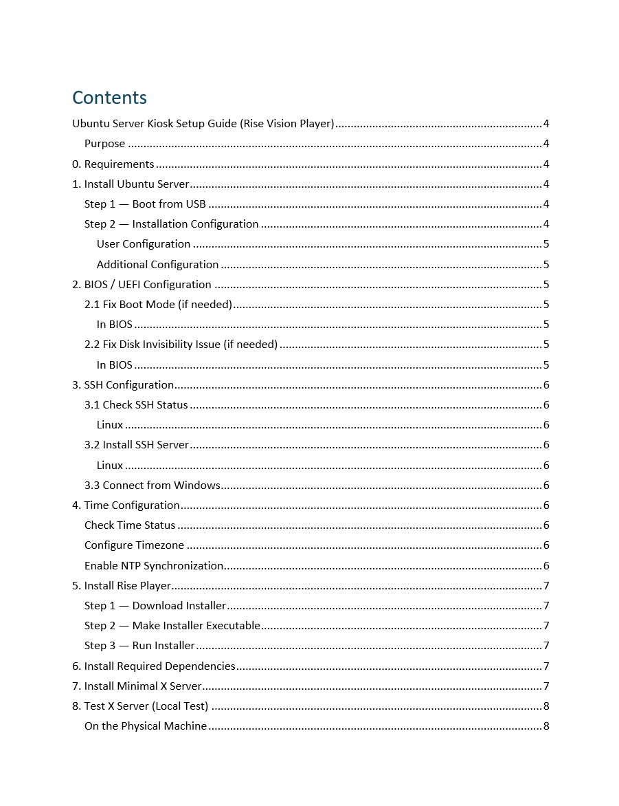
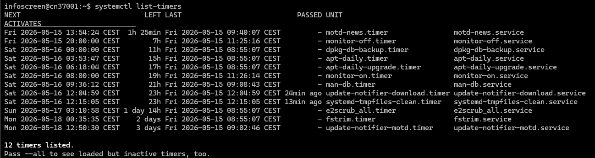
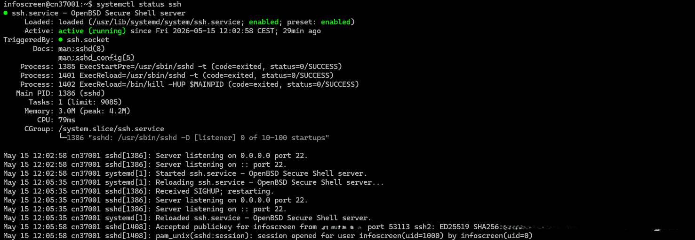
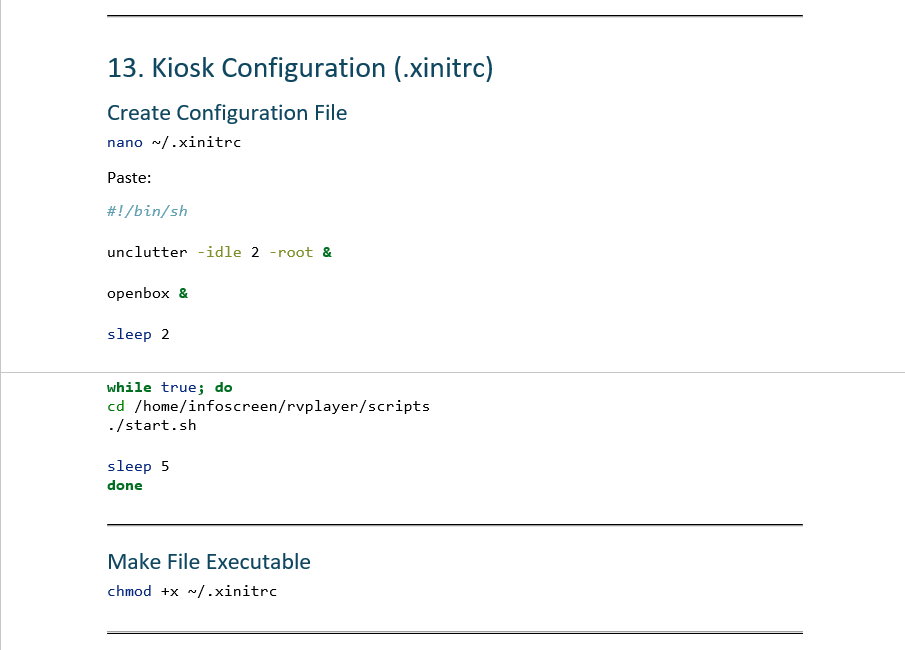
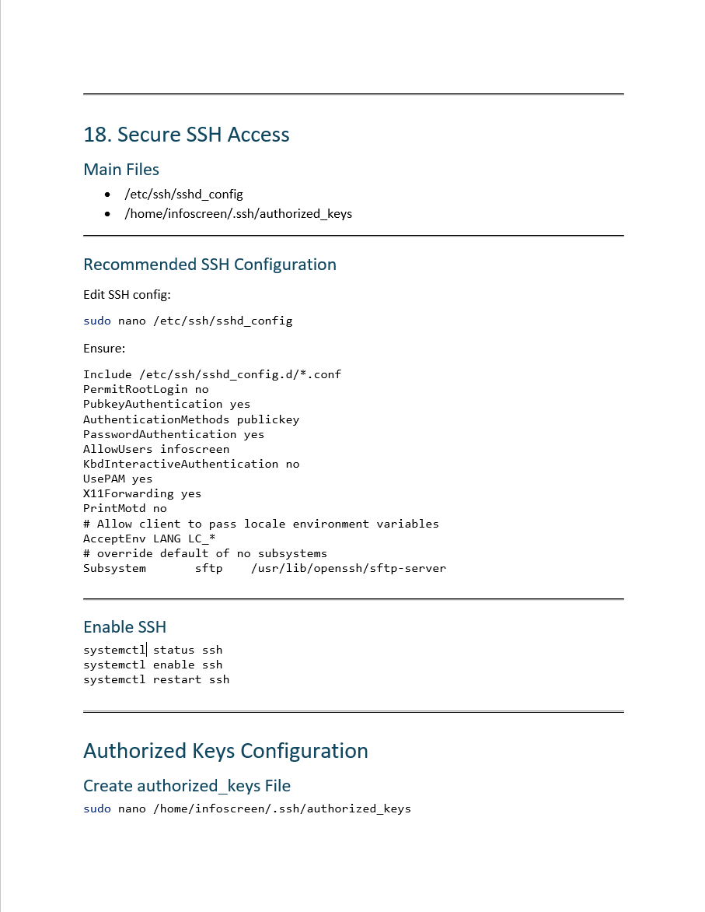

# Linux Kiosk Infrastructure

Ubuntu Server based digital signage kiosk infrastructure using Rise Vision Player, Xorg/Openbox kiosk mode, systemd automation and SSH hardening.

---

## Overview

This project documents the deployment and configuration of a Linux-based digital signage kiosk environment built with Ubuntu Server and Rise Vision Player.

The setup was designed as a lightweight and automated kiosk system capable of:

- automatic login
- automatic X session startup
- kiosk application auto-launch
- monitor power scheduling
- remote SSH management
- recovery after power loss

The project also includes full deployment documentation, infrastructure configuration files and operational screenshots from the environment.

---

## Features

- Ubuntu Server kiosk deployment
- Rise Vision Player integration
- Xorg + Openbox kiosk mode
- SSH hardening
- systemd automation
- Monitor scheduling
- Auto-login configuration
- Deployment documentation
- BIOS/UEFI recovery configuration
- Remote management over SSH

---

## Technologies

- Ubuntu Server 24.04 LTS
- Linux
- SSH
- Xorg
- Openbox
- systemd
- Rise Vision Player
- Bash
- systemd timers/services

---

## Project Structure

```text
linux-kiosk-infrastructure/
│
├── README.md
├── docs/
│   └── kiosk-setup.md
│
├── configs/
│   ├── .xinitrc
│   ├── monitor-off.service
│   ├── monitor-on.service
│   ├── monitor-off.timer
│   ├── monitor-on.timer
│   └── sshd_config
│
├── screenshots/
│
└── scripts/
    ├── enable-timers.sh
    ├── install-dependencies.sh
    └── install-xorg.sh
```

---

## Screenshots

### Documentation Structure



---

### systemd Timers

Monitor scheduling automation using systemd timers.



---

### SSH Service Status

SSH service running and enabled for remote administration.



---

### Kiosk Configuration (.xinitrc)

Automatic kiosk startup loop using Openbox and Rise Player.



---

### Secure SSH Documentation

SSH hardening and permissions configuration.



---

## Documentation

Full deployment and installation guide:

```text
docs/kiosk-setup.md
```

---

## Infrastructure Components

The project includes:

- Ubuntu Server deployment
- Rise Vision Player installation
- Minimal X server configuration
- Openbox kiosk environment
- SSH configuration and hardening
- systemd monitor scheduling
- Automatic login and startup
- BIOS/UEFI power recovery configuration

---

## Notes

Sensitive infrastructure information such as:

- internal IP addresses
- SSH private keys
- production-specific identifiers

has been removed or sanitized before publication.

---

## Author

Artem Shmahaylo

- AWS Certified Solutions Architect – Associate
- AWS Certified Cloud Practitioner
- IT Helpdesk Technician
- Linux / Infrastructure / Cloud enthusiast